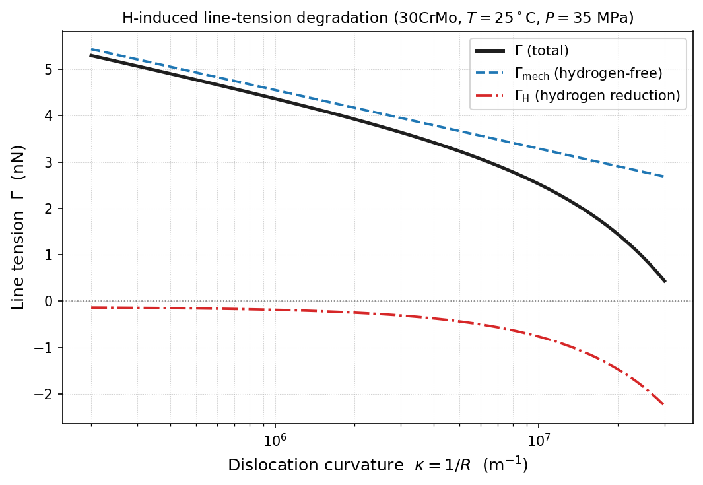

# scr.md — Version 1 script output

Command:

```bash
python scripts/analyze_line_tension.py
```

Full console output of `scripts/analyze_line_tension.py`:

```
========================================================================
Line-tension degradation theory - Version 1 fixed-state proof (30CrMo storage steel)
========================================================================
  Fixed temperature   T      = 298.15 K  (25.00 °C)
  Fixed pressure       P_ext = 3.500e+07 Pa  (35.0 MPa)
------------------------------------------------------------------------
  Abel-Noble real-gas EOS:  P (V - b) = R T
  Co-volume            b_AN  = 1.580e-05 m^3/mol
  Fugacity coefficient phi  = 1.249916  (ideal = 1.000000)
  H2 fugacity          f     = 4.375e+07 Pa  (43.747 MPa)
  Ideal-gas fugacity   f_id  = 3.500e+07 Pa  (35.000 MPa)
------------------------------------------------------------------------
  Sieverts coefficient K_s   = 7.100e-05 mol/(m^3 Pa^0.5)
  Surface concentration C_s = 4.696e-01 mol/m^3
  Trap binding energy  D G_b = 30.0 kJ/mol
  Lattice site density N_L   = 8.460e+05 mol/m^3
  Burgers vector       b      = 2.480e-10 m
  Shear modulus        mu     = 7.950e+10 Pa
  Poisson ratio        nu     = 0.2900
========================================================================
   kappa [1/m]     R [nm]  Gamma_mech [nN]   Gamma_H [nN]   Gamma [nN]
------------------------------------------------------------------------
     2.000e+05    5000.00           5.4318        -0.1376       5.2942
     2.000e+05    5000.00           5.4318        -0.1376       5.2942
     2.270e+05    4404.32           5.3623        -0.1393       5.2230
     2.746e+05    3641.18           5.2580        -0.1421       5.1159
     4.018e+05    2488.69           5.0494        -0.1498       4.8996
     7.577e+05    1319.82           4.7018        -0.1714       4.5304
     2.694e+06     371.20           4.0067        -0.2903       3.7163
     2.816e+07      35.52           2.7206        -2.0992       0.6214
========================================================================
  Gamma_H < 0 confirms hydrogen-induced line-tension DEGRADATION.
  Larger kappa (tighter bowing) -> deeper reduction (line-tension degradation).
========================================================================
  Figure saved to: /home/kirmizi/Desktop/hyd/figures/line_tension_vs_curvature.png
```

Recreated figure (`figures/line_tension_vs_curvature.png`):


